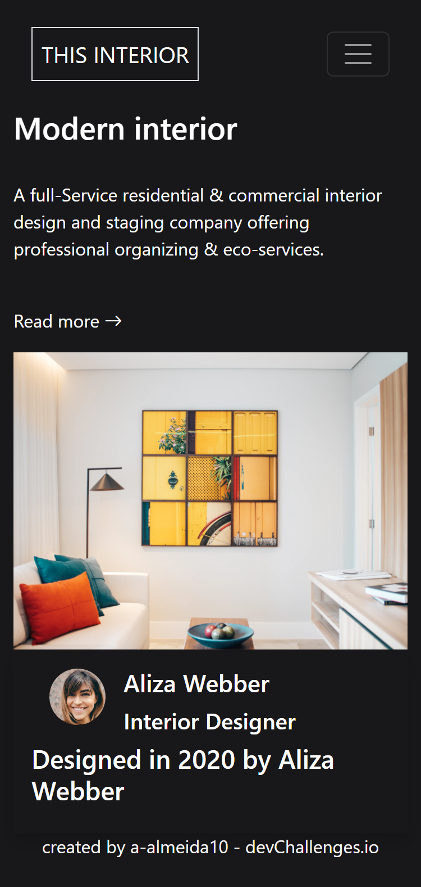

<h1 align="center">Interior Consultant Page</h1>

   Solução para um desafio de <a href="http://devchallenges.io" target="_blank">Devchallenges.io</a>.

  <h3>
    <a  target="_blank" href="https://vercel.com/a-almeida10/interios-consultant-challenge-9mc3">
     Preview
    </a>
     | 
    <a target="_blank" href="https://devchallenges.io/challenges/Jymh2b2FyebRTUljkNcb">
      Desafio
    </a>
  </h3>

<!-- TABLE OF CONTENTS -->

## Índice

- [Visão Geral](#visão-geral)
  - [Ferramentas](#ferramentas)
- [Features](#features)
- [Contato](#contato)

<!-- OVERVIEW -->

## Visão Geral

História de usuário:

- Consigo ver uma página de acordo com o [design](https://devchallenges.io/challenges/Jymh2b2FyebRTUljkNcb).
- Em dispositivos móveis a barra de navegação se transforma em um menu hambúrguer.
- Em dispositiovs móveis, ao selecionar o ícone do menu consigo ver as opções de navegação.

### Ferramentas

<!-- This section should list any major frameworks that you built your project using. Here are a few examples.-->

- HTML5
- SASS/SCSS
- Bootstrap 5

## Features

Esse site foi criado como uma solução ao [desafio](https://devchallenges.io/challenges/Jymh2b2FyebRTUljkNcb) disponível no site [DevChallenges](https://devchallenges.io/challenges).

## Contato

- Linkedin <a href="https://www.linkedin.com/in/aghata-almeida/"  target="_blank" >Ághata Almeida</a>
- Github <a href="https://github.com/a-almeida10/" target="_blank">@a-almeida10</a>
